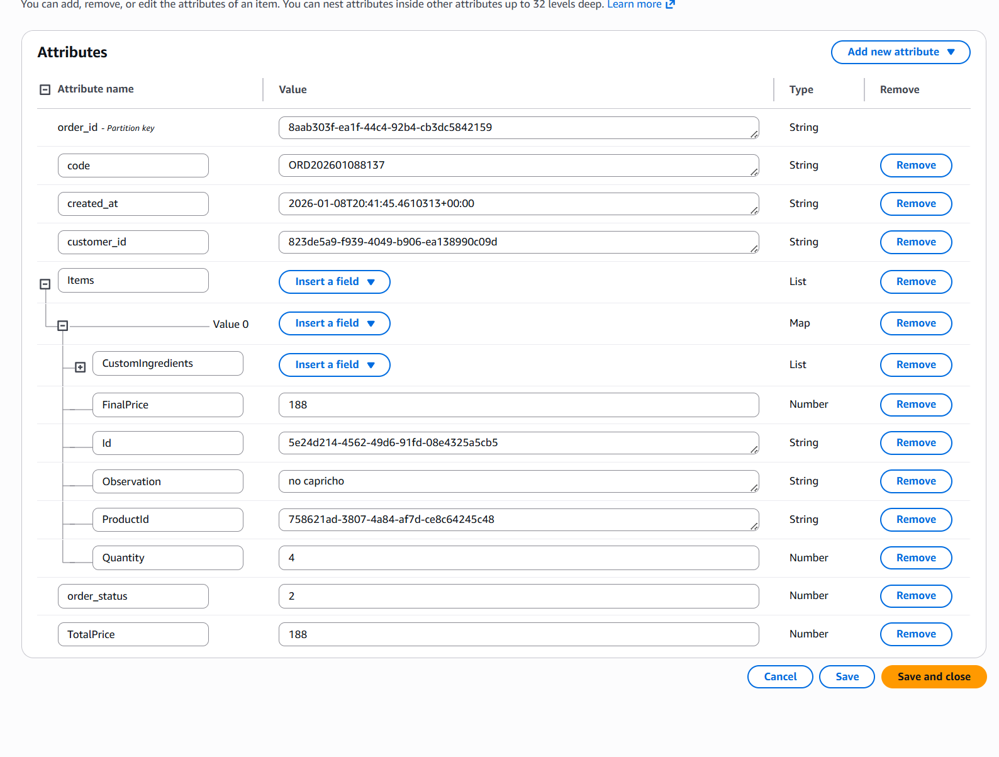
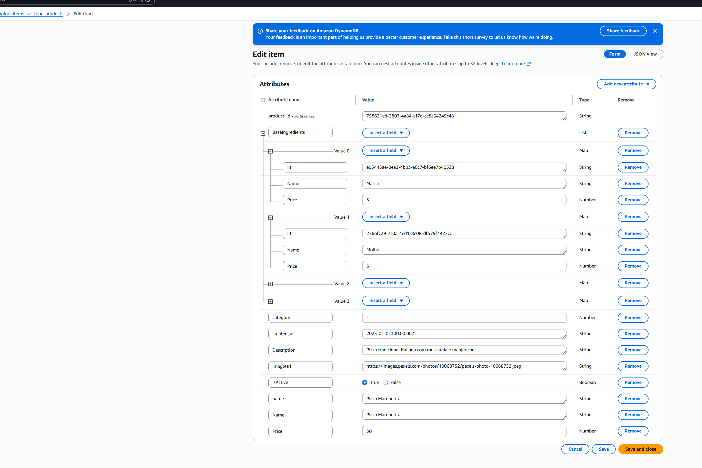
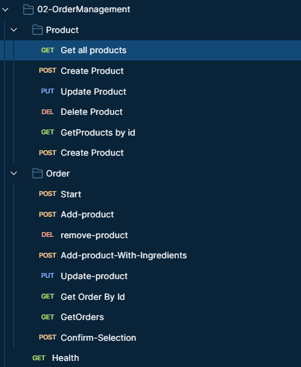
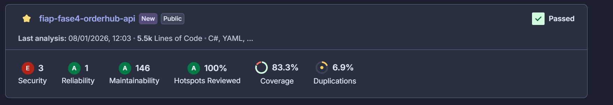

# FastFood OrderHub API

## 📋 Visão Geral do Microsserviço OrderHub

O **OrderHub** é o microsserviço responsável pelo gerenciamento completo de pedidos e produtos no ecossistema FastFood. Atuando como **fonte de verdade** do fluxo de pedidos, este serviço desempenha um papel central na arquitetura de microsserviços desacoplados.

### Responsabilidades Principais

- **Gestão de Pedidos**: Criação, consulta, atualização e finalização de pedidos
- **Gestão de Produtos**: Catálogo completo de produtos com ingredientes base e customizações
- **Orquestração de Fluxo**: Coordenação do ciclo de vida do pedido desde a criação até a confirmação para pagamento
- **Integração com Microsserviços**: Comunicação síncrona via HTTP com PayStream para processamento de pagamentos

### Características Arquiteturais

- **Microsserviço Independente**: Implantado e escalado de forma autônoma
- **Banco de Dados Exclusivo**: Utiliza Amazon DynamoDB como banco de dados dedicado
- **Desacoplamento**: Não acessa bancos de dados de outros microsserviços
- **Comunicação Síncrona**: Integração via HTTP REST com outros serviços
- **Deploy Independente**: Infraestrutura orquestrada via Kubernetes, permitindo deploy e escalonamento independentes

---

## 🗄️ Banco de Dados – Amazon DynamoDB

O OrderHub utiliza **Amazon DynamoDB** como banco de dados NoSQL para persistência de dados de pedidos e produtos. Esta escolha arquitetural foi fundamentada em requisitos específicos do domínio de pedidos.

### Justificativa Arquitetural

O DynamoDB foi selecionado para o OrderHub devido às seguintes características:

- **Baixa Latência**: Acesso a dados em milissegundos, essencial para operações de alta frequência
- **Alta Disponibilidade**: SLA de 99.99% de uptime, garantindo continuidade do serviço
- **Escalabilidade Automática**: Capacidade on-demand que se adapta automaticamente à carga de trabalho
- **Modelo Orientado a Agregados**: Excelente aderência ao modelo de dados onde Order e Items formam um agregado coeso
- **Alto Volume**: Otimizado para fluxos de pedido em grande escala, típicos de aplicações fast food

### Modelo de Dados NoSQL

O modelo adotado segue o padrão de **Document Store**, onde cada pedido é armazenado como um documento completo contendo todos os seus itens, ingredientes customizados e metadados. Esta abordagem elimina a necessidade de joins complexos e permite leituras eficientes do agregado completo.

### Tabelas DynamoDB

O OrderHub utiliza duas tabelas principais:

#### 1. Tabela `fastfood-orders`

Armazena todos os pedidos do sistema com a seguinte estrutura:



**Características:**
- **Partition Key**: `order_id` (GUID)
- **Atributos Principais**: `code`, `customer_id`, `order_status`, `created_at`, `items` (List), `total_price`
- **Modelo de Agregado**: Cada item do pedido contém informações completas do produto, ingredientes customizados e preço final

#### 2. Tabela `fastfood-products`

Armazena o catálogo completo de produtos:



**Características:**
- **Partition Key**: `product_id` (GUID)
- **Atributos Principais**: `name`, `description`, `category`, `price`, `image_url`, `is_active`, `base_ingredients` (List)
- **Ingredientes Base**: Lista de ingredientes padrão do produto com preços individuais

### Isolamento de Dados

**Importante**: Nenhum outro microsserviço acessa diretamente as tabelas DynamoDB do OrderHub. A comunicação entre serviços é realizada exclusivamente via APIs HTTP, garantindo:

- **Encapsulamento**: Dados do OrderHub permanecem privados ao serviço
- **Evolução Independente**: Mudanças no modelo de dados não impactam outros serviços
- **Segurança**: Acesso restrito via IAM roles e políticas específicas

---

## 🔗 Endpoints e Contratos

O OrderHub expõe uma API RESTful completa para gerenciamento de pedidos e produtos. A documentação interativa está disponível via Swagger UI.

### Documentação da API

- **Swagger UI**: Disponível em `/swagger` quando executado em ambiente de desenvolvimento
- **Collection Postman**: Disponível em [`docs/CollectionTcFase4.json`](docs/CollectionTcFase4.json)

### Endpoints Disponíveis

A imagem abaixo ilustra os principais endpoints expostos pelo OrderHub, organizados por contexto funcional:


#### Gestão de Produtos (`/api/products`)

| Método | Endpoint | Descrição | Autenticação |
|--------|----------|------------|--------------|
| `GET` | `/api/products` | Listar produtos paginados | Admin (Cognito) |
| `GET` | `/api/products/{id}` | Obter produto por ID | Admin/Customer |
| `POST` | `/api/products` | Criar novo produto | Admin (Cognito) |
| `PUT` | `/api/products/{id}` | Atualizar produto | Admin (Cognito) |
| `DELETE` | `/api/products/{id}` | Remover produto | Admin (Cognito) |

#### Gestão de Pedidos (`/api/order`)

| Método | Endpoint | Descrição | Autenticação |
|--------|----------|------------|--------------|
| `GET` | `/api/order` | Listar pedidos paginados | Admin (Cognito) |
| `GET` | `/api/order/{id}` | Obter pedido por ID | Admin/Customer |
| `POST` | `/api/order/start` | Iniciar novo pedido | Customer (Bearer) |
| `POST` | `/api/order/add-product` | Adicionar produto ao pedido | Customer (Bearer) |
| `PUT` | `/api/order/update-product` | Atualizar produto no pedido | Customer (Bearer) |
| `DELETE` | `/api/order/remove-product` | Remover produto do pedido | Customer (Bearer) |
| `POST` | `/api/order/{id}/confirm-selection` | Confirmar seleção e iniciar pagamento | Customer (Bearer) |

#### Health Check

| Método | Endpoint | Descrição | Autenticação |
|--------|----------|------------|--------------|
| `GET` | `/api/health` | Verificar saúde do serviço | Público |

### Fluxo de Pedidos

O diagrama abaixo ilustra o fluxo completo de um pedido no OrderHub:



---

## 🏗️ Arquitetura do Microsserviço

O OrderHub segue uma arquitetura de microsserviços independente, projetada para alta disponibilidade e escalabilidade.

### Componentes Principais

```
┌─────────────────────────────────────────────────────────┐
│                    OrderHub API                         │
│  ┌──────────────┐  ┌──────────────┐  ┌─────────────┐ │
│  │   Products   │  │    Order     │  │   Health    │ │
│  │  Controller  │  │  Controller  │  │  Controller │ │
│  └──────┬───────┘  └──────┬───────┘  └──────┬──────┘ │
│         │                  │                  │        │
│         └──────────────────┼──────────────────┘        │
│                            │                           │
│  ┌─────────────────────────▼─────────────────────────┐ │
│  │            Application Layer (UseCases)           │ │
│  │  - StartOrderUseCase                              │ │
│  │  - AddProductToOrderUseCase                       │ │
│  │  - ConfirmOrderSelectionUseCase                   │ │
│  │  - GetOrderByIdUseCase                            │ │
│  └─────────────────────────┬─────────────────────────┘ │
│                            │                           │
│  ┌─────────────────────────▼─────────────────────────┐ │
│  │         Infrastructure Layer (Repositories)         │ │
│  │  - OrderDynamoDbRepository                        │ │
│  │  - ProductDynamoDbRepository                      │ │
│  │  - PaymentServiceClient                           │ │
│  └─────────────────────────┬─────────────────────────┘ │
└────────────────────────────┼───────────────────────────┘
                             │
                ┌────────────▼────────────┐
                │   Amazon DynamoDB      │
                │  - fastfood-orders     │
                │  - fastfood-products  │
                └────────────────────────┘
```

### Comunicação entre Microsserviços

- **Comunicação Síncrona**: Integração via HTTP REST com PayStream para criação de pagamentos
- **Desacoplamento**: Cada microsserviço possui seu próprio banco de dados
- **Orquestração**: OrderHub orquestra o fluxo de pedidos, delegando pagamento ao PayStream

### Infraestrutura

- **Containerização**: Aplicação containerizada com Docker
- **Orquestração**: Deploy e gerenciamento via Kubernetes (EKS)
- **Escalabilidade**: Escalonamento horizontal baseado em demanda
- **Isolamento**: Cada instância do serviço opera de forma independente

---

## 🧱 Clean Architecture (Abordagem Pragmática)

O OrderHub adota uma **abordagem pragmática** de Clean Architecture, com aproximadamente **70% de aderência** aos princípios clássicos. Esta decisão arquitetural foi tomada conscientemente para equilibrar organização de código com simplicidade e produtividade.

### Decisões Arquiteturais

#### O que foi mantido (70% de aderência):

- **UseCases Claros**: Lógica de negócio isolada em casos de uso específicos
- **Domínio Isolado**: Entidades e regras de negócio no núcleo do sistema
- **Infra Separada**: Implementações de persistência e integrações externas isoladas
- **Injeção de Dependência**: DI concentrada na borda (API/Program.cs)
- **Ports e Adapters**: Interfaces definidas na Application, implementações na Infra

#### O que foi simplificado (30% de flexibilidade):

- **Boilerplate Reduzido**: Evitado excesso de abstrações desnecessárias
- **Complexidade Controlada**: Priorização de simplicidade sobre pureza arquitetural
- **Produtividade**: Foco em entregar valor sem sobre-engenharia

### Estrutura de Camadas

```
src/
├── Core/
│   ├── FastFood.OrderHub.Domain/          # Entidades e regras de negócio
│   ├── FastFood.OrderHub.Application/      # UseCases, DTOs, Ports (interfaces)
│   └── FastFood.OrderHub.CrossCutting/    # Utilitários compartilhados
├── Infra/
│   ├── FastFood.OrderHub.Infra/           # Serviços e integrações
│   └── FastFood.OrderHub.Infra.Persistence/ # Repositórios DynamoDB
└── InterfacesExternas/
    ├── FastFood.OrderHub.Api/             # Controllers, Program.cs
    └── FastFood.OrderHub.Migrator/        # Scripts de migração
```

### Princípios Aplicados

1. **Dependency Rule**: Dependências apontam para dentro (API → Application → Domain)
2. **Separation of Concerns**: Cada camada tem responsabilidade clara
3. **Testabilidade**: Uso de interfaces permite mock e testes isolados
4. **Flexibilidade**: Decisões arquiteturais permitem evolução sem grandes refatorações

**Nota**: Esta abordagem pragmática é uma decisão arquitetural consciente, não uma limitação técnica. O objetivo é manter código limpo e organizado sem sacrificar produtividade.

---

## 🧪 Qualidade, Testes e BDD

O OrderHub mantém um rigoroso processo de garantia de qualidade, com foco em cobertura de testes, testes BDD e análise estática de código.

### Cobertura de Testes

O projeto mantém aproximadamente **80% de cobertura de código**, distribuída entre as camadas:

- **Domain**: ≥ 90% de cobertura
- **Application (UseCases)**: ≥ 80% de cobertura
- **Infra (Repositories, Services)**: ≥ 75% de cobertura
- **API (Controllers)**: ≥ 70% de cobertura

### Tipos de Testes Implementados

#### Testes Unitários

Projeto: `FastFood.OrderHub.Tests.Unit`

- Testes isolados de UseCases com mocks
- Testes de entidades de domínio
- Testes de repositórios com DynamoDB local
- Validação de regras de negócio

#### Testes BDD (Behavior Driven Development)

Projeto: `FastFood.OrderHub.Tests.Bdd`

Implementação usando **SpecFlow** para testes orientados a comportamento:

**Exemplo de Feature BDD:**

```gherkin
Feature: Get Order By ID
    As a system user (admin or customer)
    I want to retrieve an order by its ID
    So that I can view order details

    Scenario: Admin obtains order by ID successfully
        Given I am an admin user
        And there is an order with ID "123e4567-e89b-12d3-a456-426614174000"
        When I request to get the order with ID "123e4567-e89b-12d3-a456-426614174000"
        Then the order should be returned successfully
```

**Fluxos BDD Implementados:**
- Obtenção de pedido por ID (Admin e Customer)
- Validação de acesso e segurança
- Cenários de erro e casos limite

### Qualidade de Código

#### SonarQube / SonarCloud

- **Análise Estática**: Executada automaticamente no pipeline CI/CD
- **Quality Gate**: Bloqueia merges que não atendam aos critérios de qualidade
- **Métricas Monitoradas**:
  - Cobertura de testes (mínimo 80%)
  - Code smells e bugs
  - Duplicação de código
  - Complexidade ciclomática
  - Vulnerabilidades de segurança

**Status de Qualidade:**



[](https://sonarcloud.io/project/overview?id=diegoknsk_fiap-fase4-orderhub-api)
[](https://sonarcloud.io/project/overview?id=diegoknsk_fiap-fase4-orderhub-api)
[](https://sonarcloud.io/project/overview?id=diegoknsk_fiap-fase4-orderhub-api)
[](https://sonarcloud.io/project/overview?id=diegoknsk_fiap-fase4-orderhub-api)
[](https://sonarcloud.io/project/overview?id=diegoknsk_fiap-fase4-orderhub-api)

**Dashboard Completo**: [Visualizar no SonarCloud](https://sonarcloud.io/project/overview?id=diegoknsk_fiap-fase4-orderhub-api)

#### Pipeline CI/CD

O pipeline de CI/CD valida automaticamente:

1. **Build**: Compilação do projeto sem erros
2. **Testes Unitários**: Execução completa da suíte de testes
3. **Cobertura**: Validação de cobertura mínima (80%)
4. **Análise Sonar**: Análise estática de código
5. **Quality Gate**: Validação de critérios de qualidade

**Bloqueios Automáticos:**
- Build falha se cobertura < 80%
- Merge bloqueado se Quality Gate do Sonar falhar
- Testes devem passar em todas as execuções

### Ferramentas Utilizadas

- **xUnit**: Framework de testes unitários
- **Moq**: Framework de mocking
- **FluentAssertions**: Assertions legíveis e expressivas
- **SpecFlow**: Framework BDD para .NET
- **Coverlet**: Coleta de métricas de cobertura
- **SonarCloud**: Análise estática e qualidade de código

---

## 🔐 Segurança e Configurações

O OrderHub implementa múltiplas camadas de segurança para proteger dados e operações.

### Autenticação e Autorização

#### Esquemas de Autenticação

1. **Customer Bearer Token**
   - JWT gerado pelo microsserviço de autenticação de clientes
   - Usado para operações de clientes (criar pedido, adicionar produtos)
   - Validação de `customer_id` no token vs. `customer_id` do pedido

2. **Cognito JWT**
   - JWT gerado pelo AWS Cognito
   - Usado para operações administrativas (listar pedidos, gerenciar produtos)
   - Políticas de autorização baseadas em roles

#### Políticas de Autorização

- **Admin Policy**: Acesso completo a todos os endpoints
- **Customer Policy**: Acesso restrito a operações do próprio cliente

### Configurações e Secrets

#### Variáveis de Ambiente

O OrderHub utiliza variáveis de ambiente para configuração, seguindo o padrão do .NET:

```bash
# DynamoDB Configuration
DynamoDb__AccessKey=<AWS_ACCESS_KEY>
DynamoDb__SecretKey=<AWS_SECRET_KEY>
DynamoDb__Region=us-east-1
DynamoDb__SessionToken=<AWS_SESSION_TOKEN>  # Opcional (AWS Academy)

# JWT Configuration
JwtCustomer__SecretKey=<JWT_SECRET>
JwtCustomer__Issuer=<JWT_ISSUER>
JwtCustomer__Audience=<JWT_AUDIENCE>

# Payment Service Integration
PaymentService__BaseUrl=<PAYMENT_SERVICE_URL>
PaymentService__TimeoutSeconds=30
```

#### Gerenciamento de Secrets

- **Nenhuma credencial versionada**: Todas as credenciais são injetadas via variáveis de ambiente
- **Kubernetes Secrets**: Secrets gerenciados via Kubernetes em produção
- **AWS IAM Roles**: Acesso ao DynamoDB restrito via IAM policies

### Acesso ao DynamoDB

- **Credenciais IAM**: Acesso via Access Key e Secret Key configuradas
- **Políticas Restritivas**: Apenas operações necessárias são permitidas
- **Isolamento**: Acesso restrito apenas ao OrderHub, sem compartilhamento com outros serviços

### HTTPS e SSL

- **HTTPS Obrigatório**: Todas as comunicações em produção utilizam HTTPS
- **Certificados TLS**: Gerenciados via Kubernetes Ingress

---

## 🚀 Executando o Projeto

### Pré-requisitos

- .NET 8 SDK
- Docker (opcional, para DynamoDB local)
- AWS CLI configurado (para acesso ao DynamoDB)

### Configuração Local

1. **Clonar o repositório**
   ```bash
   git clone <repository-url>
   cd fiap-fase4-orderhub-api
   ```

2. **Configurar variáveis de ambiente**
   ```bash
   export DynamoDb__AccessKey=<your-access-key>
   export DynamoDb__SecretKey=<your-secret-key>
   export DynamoDb__Region=us-east-1
   ```

3. **Executar a aplicação**
   ```bash
   dotnet run --project src/InterfacesExternas/FastFood.OrderHub.Api
   ```

4. **Acessar Swagger**
   ```
   https://localhost:5001/swagger
   ```

### Executar Testes

```bash
# Testes unitários
dotnet test src/tests/FastFood.OrderHub.Tests.Unit

# Testes BDD
dotnet test src/tests/FastFood.OrderHub.Tests.Bdd

# Com cobertura
dotnet test /p:CollectCoverage=true /p:CoverletOutputFormat=opencover
```

---

## 📚 Documentação Adicional

- [CI/CD Setup](docs/CI_CD_SETUP.md)
- [Collection Postman](docs/CollectionTcFase4.json)
- [Regras de Arquitetura](rules/ARCHITECTURE_RULES.md)
- [Regras de Testes](rules/TEST_WRITING_RULES.md)

---

## 📝 Licença

Este projeto faz parte do Tech Challenge – Fase 4 da Pós Tech (Arquitetura de Microsserviços) da FIAP.

---

## 👥 Contribuidores

Equipe FastFood - Tech Challenge Fase 4
